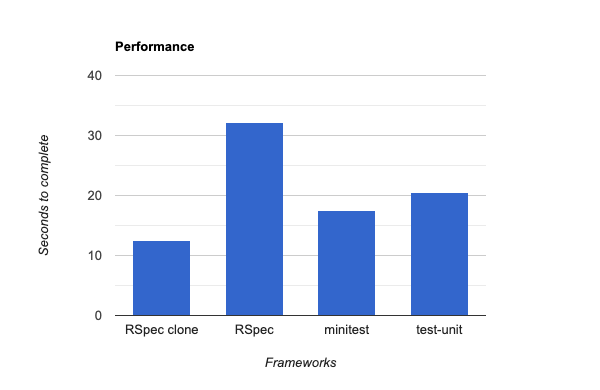

# Overview

__RSpec clone__ provides a structure for writing executable examples of how your code should behave.

Inspired by [RSpec](https://rspec.info/), it includes a domain specific language (DSL) that allows you to write examples in a way similar to plain english.

A basic spec looks something like this:

# Anatomy of a spec file

To use the `RSpec` module and its DSL, you need to add `require "r_spec"` to your spec files.
Many projects use a custom spec helper which organizes these includes.

Concrete test cases are defined in `it` blocks.
An optional descriptive string states it's purpose and a block contains the main logic performing the test.

Test cases that have been defined or outlined but are not yet expected to work can be defined using `pending` instead of `it`. They will not be run but show up in the spec report as pending.

An `it` block contains an example that should invoke the code to be tested and define what is expected of it.
Each example can contain multiple expectations, but it should test only one specific behaviour.

To express an expectation, wrap an object or block in `expect`, call `to` (or `not_to`) and pass it a matcher object.
If the expectation is met, code execution continues.
Otherwise the example has _failed_ and other code will not be executed.

In test files, specs are structured by example groups which are defined by `describe` and `context` sections.
Typically a top level `describe` defines the outer unit (such as a class) to be tested by the spec.
Further `describe` sections can be nested within the outer unit to specify smaller units under test (such as individual methods).

For unit tests, it is recommended to follow the conventions for method names:

* outer `describe` is the name of the class, inner `describe` targets methods;
* instance methods are prefixed with `#`, class methods with `.`.

To establish certain contexts — think _empty array_ versus _array with elements_ — the `context` method may be used to communicate this to the reader.
It has a different name, but behaves exactly like `describe`.

`describe` and `context` take an optional description as argument and a block containing the individual specs or nested groupings.

# Performance

Benchmark against [100 executions of a file containing one expectation](https://github.com/cyril/r_spec.rb/blob/main/benchmark/) (lower is better).

# Special thanks ❤️

I would like to thank the whole [RSpec team](https://rspec.info/about/) for all their work.
It's a great framework and it's a pleasure to work with every day.

Without RSpec, this clone would not have been possible.

# Buy me a coffee ☕

If you like this project please consider making a small donation.

